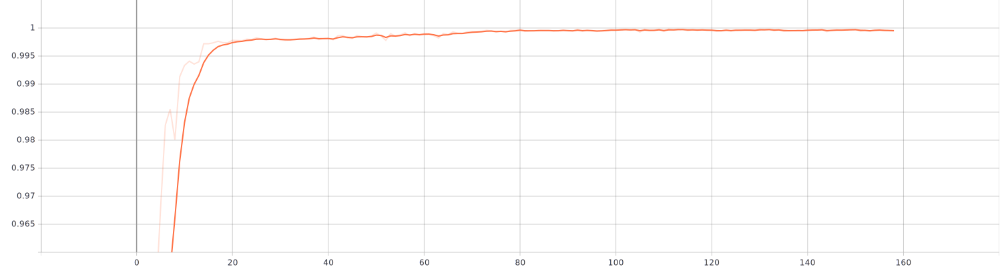
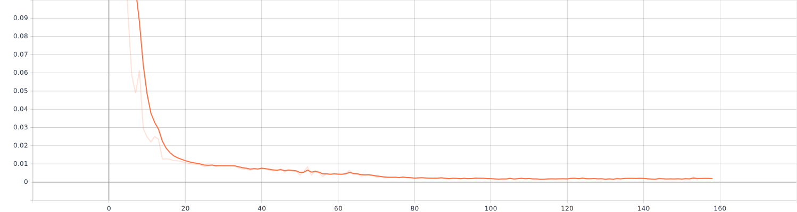
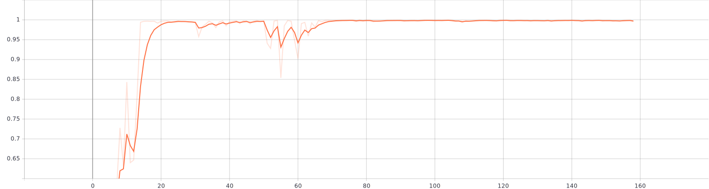

# Driver Drowsiness Classification

## Project Overview:
This repository hosts the source code, data, and resources for a project that focuses on detecting driver drowsiness using deep learning techniques. Drowsy driving is a critical issue that poses a threat to road safety. Leveraging the power of machine learning and computer vision, this project aims to create an intelligent system capable of real-time driver drowsiness detection.

## Dataset
The dataset belongs to the kaggle in this link. I splitted 70/30 for validation and used filp horizontal and rotation augmentation.

 

## Model
The model that I used was combination of transformers and resnet34 backbone.

 

## Training 
For the training i used AdamW optimizer with 0.01 learning rate and weight decay: 0.001.

 

## Results
The result of the training was very good with fast convergence.

### Training accuracy

### Training loss

### validation accuracy

### validation loss

